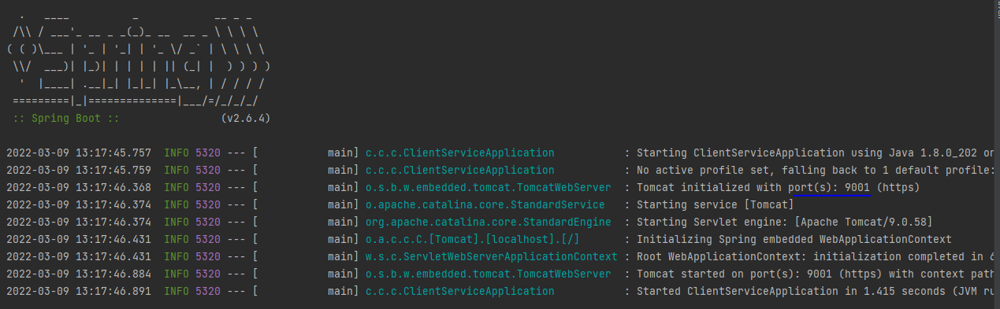
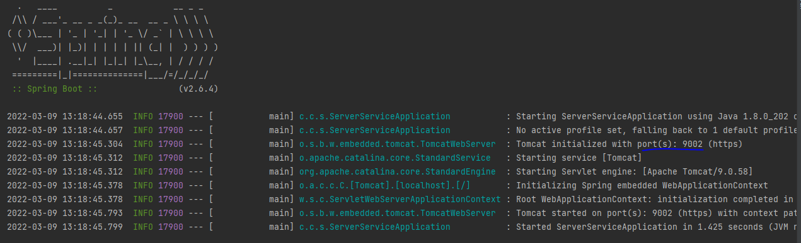
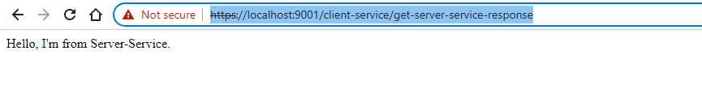
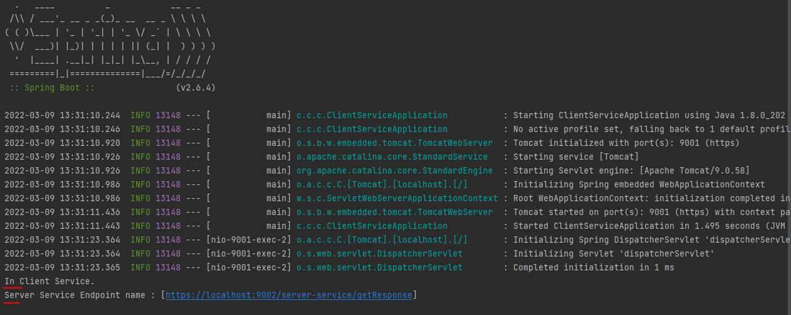
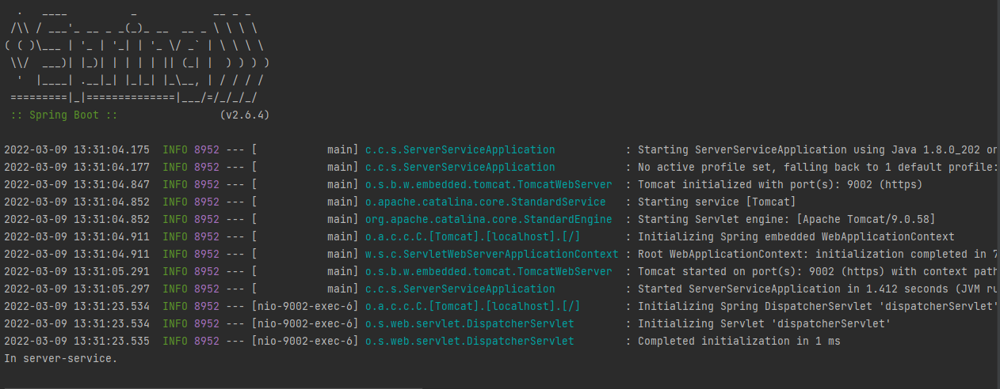
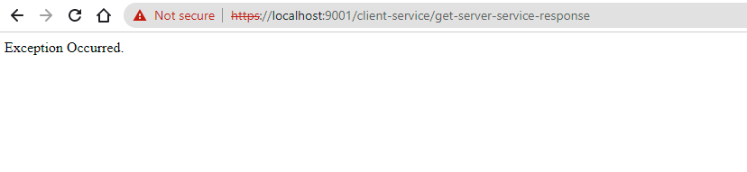
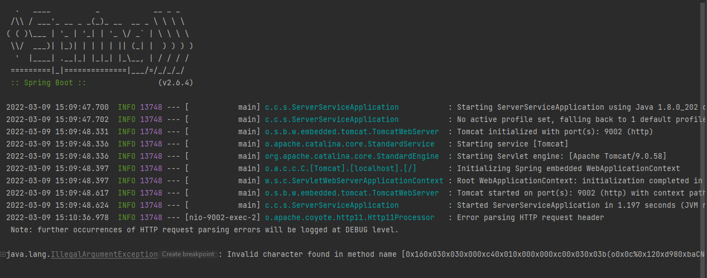

> > Project Background Study:

SSL (Secure Socket Layer) is the standard technology used for enabling secure communication between a client and server
to ensure data security & integrity. SSL has evolved with time and several versions have been introduced to deal with
any potential vulnerabilities. SSL V2 released in 1995 was the first public version of SSL followed by SSL V3 in 1996
followed by TLS V1.0 in 1999, TLS V1.1 in 2006, and TLS V1.2 in 2008.

For ensuring the security of the data being transferred between a client and server, SSL can be implemented either
one-way or two-way.

### How one-way-SSL works?

In one way SSL, the only client validates the server to ensure that it receives data from the intended server. For
implementing one-way SSL, the server shares its public certificate with the clients.

Below is the high-level description of the steps involved in the establishment of connection and transfer of data
between a client and server in case of one-way SSL:

1. Client requests for some protected data from the server on HTTPS protocol. This initiates SSL/TLS handshake process.
2. Server returns its public certificate to the client along with server hello message.
3. Client validates/verifies the received certificate. The client verifies the certificate through the certification
   authority (CA) for CA-signed certificates.
4. SSL/TLS client sends the random byte string that enables both the client and the server to compute the secret key to
   be used for encrypting subsequent message data. The random byte string itself is encrypted with the server’s public
   key.
5. After agreeing on this secret key, the client and server communicate further for actual data transfer by
   encrypting/decrypting data using this key.

Below is the pictorial description explaining how one-way SSL works:


### How Two-Way (Mutual) SSL works?

Contrary to one-way SSL; in case of two-way SSL, both client and server authenticate each other to ensure that both
parties involved in the communication are trusted. Both parties share their public certificates to each other and then
verification/validation is performed based on that.

Below is the high-level description of the steps involved in the establishment of connection and transfer of data
between a client and server in the case of two-way SSL:

1. Client requests a protected resource over HTTPS protocol and the SSL/TSL handshake process begins.
2. Server returns its public certificate to the client along with server hello.
3. Client validates/verifies the received certificate. The client verifies the certificate through the certification
   authority (CA) for CA-signed certificates.
4. If the Server certificate was validated successfully, the client will provide its public certificate to the server.
5. Server validates/verifies the received certificate. The server verifies the certificate through the certification
   authority (CA) for CA-signed certificates.
6. After completion of the handshake process, the client and server communicate and transfer data with each other
   encrypted with the secret keys shared between the two during the handshake.

The below image explains the same in the pictorial format:


### Terminology:

##### SSL handshakes:

SSL handshakes are a mechanism by which a client and server establish the trust and logistics required to secure their connection over the network.

##### The Handshake in One-way SSL:

If we refer to the steps mentioned above, step two mentions the certificate exchange. One-way SSL requires that a client can trust the server through its public certificate. This leaves the server to trust all clients that request a connection. There is no way for a server to request and validate the public certificate from clients which can pose a security risk.

##### The Handshake in Two-way SSL:

With one-way SSL, the server must trust all clients. But two-way SSL adds the ability for the server to be able to establish trusted clients as well. During a two-way handshake, both the client and server must present and accept each other's public certificates before a successful connection can be established.

##### Keystore:

Keystore is used to store private key and identity certificates that a specific program should present to both parties (server and client) for verification.

##### Truststore:

Truststore is used to store certificates from Certified Authorities (CA) that verify the certificate presented by the server in SSL connection.

##### Keystore vs Truststore

A Keystore contains private keys and certificates with their corresponding public keys. A truststore contains certificates from other parties that you expect to communicate with, or from Certificate Authorities that you trust to identify other parties.

1. Keystore stores your credential. (Server or client) but Truststore stores other credentials (CA).
2. Keystore is needed when you are setting up the server-side on SSL, but Truststore setup is required for the successful connection at the client-side.
3. Keystore contains private and sensitive information, but Truststore doesn’t contain private and sensitive information.

> > Project Implementation Process

## Create Self signed Certificate for Client and Server

### Client Self signed Certificate:

```text
keytool -genkeypair -alias client-service -keyalg RSA -keysize 2048 -storetype JKS -keystore client-service.jks -validity 3650 -ext SAN=dns:localhost,ip:127.0.0.1
```

### Server Self signed Certificate:

```text
keytool -genkeypair -alias server-service -keyalg RSA -keysize 2048 -storetype JKS -keystore server-service.jks -validity 3650 -ext SAN=dns:localhost,ip:127.0.0.1
```

Now we have client and server certs. So we need to set up trust between the certs. For gain the trust-ability we will
import client cert into servers trusted certificates and vice-versa.

Before doing this we extract public certificate from the jks files.

# Create public certificate file from Client and Server cert

### Extract public certificate from Client cert

```text
keytool -export -alias client-service -file client-service.crt -keystore client-service.jks
```

### Extract public certificate from Server cert

```text
keytool -export -alias server-service -file server-service.crt -keystore server-service.jks
```

Now, we will have to import client’s cert to server’s keystore and server’s cert to client’s keystore file.

### Import Client Certificate to Server jks file

```text
keytool -import -alias client-service -file client-service.crt -keystore server-service.jks
```

### Import Server Cert to Client jks File:

```text
keytool -import -alias server-service -file server-service.crt -keystore client-service.jks
```

# Configure Server For 2 Way SSL:

1. Firstly, Copy final server jks file (in my case, server-service.jks) to the src/main/resources/ folder of
   server-service application.
2. Secondly, copy final client jks (in my case client-service.jks) to src/main/resources/ folder of client-service
   application.

### Add the entries shown below in application.yml into client-service

```yaml
spring:
  application:
    name: client-service

server:
  port: 9001
  ssl:
    enabled: true
    client-auth: need
    key-store: classpath:client-service.jks
    key-store-password: client-service
    key-alias: client-service
    key-store-type: JKS
    key-store-provider: SUN
    trust-store: classpath:client-service.jks
    trust-store-password: client-service
    trust-store-type: JKS
```

### Add the entries shown below in application.yml into server-service

```yaml
spring:
  application:
    name: server-service

server:
  port: 9002
  ssl:
     enabled: true
    client-auth: need
     key-store: classpath:server-service.jks
     key-store-password: server-service
     key-alias: server-service
     key-store-type: JKS
     key-store-provider: SUN
     trust-store: classpath:server-service.jks
     trust-store-password: server-service
     trust-store-type: JKS
```

Because it’s 2 way SSL. When we access gateway url in browser, our browser becomes the client to our gateway application
and so, our gateway web app will ask the browser to present a cert for authentication.

To overcome this, we will have to import a cert to our browser. But our browser can’t understand a .jks file. Instead,
it understands PKCS12 format. So, how do we convert .jks file to PKCS12 format? Again, keytool command to the rescue!!

```text
keytool -importkeystore -srckeystore server-service.jks -destkeystore server-service.p12 -srcstoretype JKS -deststoretype PKCS12 -srcstorepass server-service-password -deststorepass server-service-password -srcalias server-service -destalias server-service -srckeypass server-service-password -destkeypass server-service-password -noprompt
```

# Project Output Demo:

> Step - 01 :: Running two Services

1. Client Service Running
   

2. Server Service Running
   

> Step - 02 :: Call Client Service To Server Service with maintain mutual SSL Communication

1. Hit the API
   

2. Client Service Console
   

3. Server Service Console
   

> Step - 03 :: Call Client Service To Server Service without maintain mutual SSL Communication

1. Hit the API
   

2. Client Service Console
   

3. Server Service Console
   
